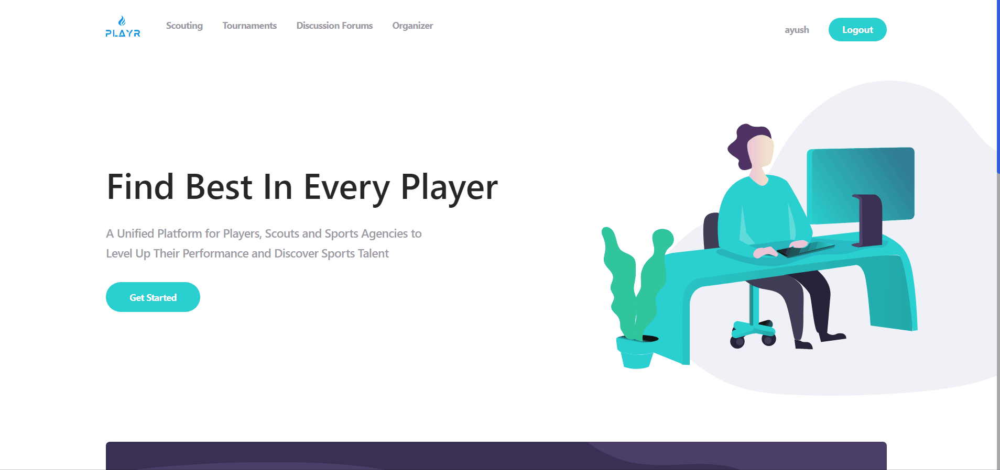
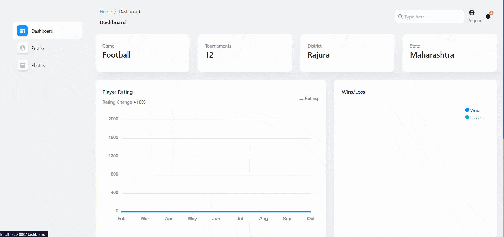
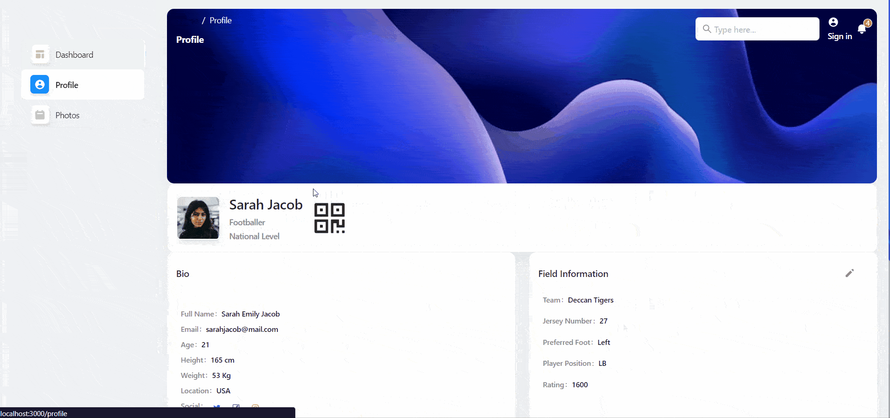
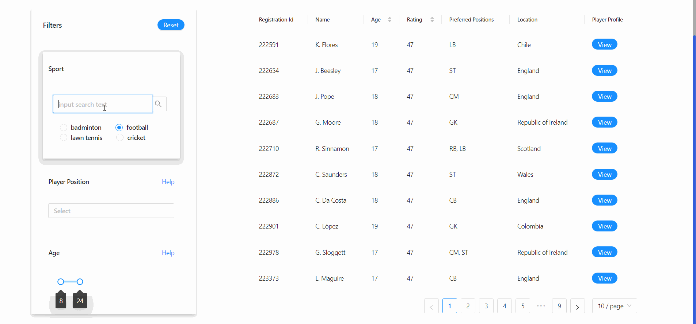
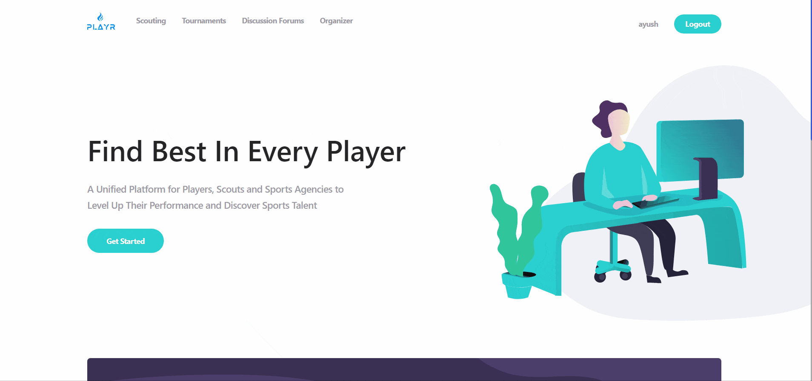

  <h1>PlayR</h1> 
<h3>An Unified platform for Players, Scouts and Sports Agencies </h3>

 

            

    <h1>Team: Disruptors</H1>
    <H3>Hack For Sport : 2022 </h3>
    <h3> Theme: Grassroots</h3>
    <h3> Team Members: <strong>Sushil Adwe | Chirag Hegde | Ayush Yadav</strong></h3>
    <h3> Indian Institute of Technology, Guwahati </h3>

 

**Demo Website** : [https://playr-v1.netlify.app/](https://playr-v1.netlify.app/) 

<!-- ABOUT THE PROJECT -->

## **Problem Statement**
Build a solution that can further enhance the grassroots parameters such as prevention of age fraud, enhancing player performance, talent scouting for all sports nationally, etc.

**Overview**

Grassroot sports are extremely important to any developing sporting nation. It is a foundation for sport for life and for high performance sport but, more importantly, when delivered well it creates immense value and develops more talents for the country in the years to come. One must recognize that in order to achieve its strategic outcomes, more emphasis must be given on the delivery of innovative sports program at the junior levels. Grassroots sports in India, however, is plagued with a lot of challenges. How to enhance player performance at junior levels, prevent age fraud, undertaking impactful talent scouting in a country this large etc. to name a few.  

Create a solution that not only identifies a problem area for Grassroots sports development in India but also lays out a methodology to overcome the same. 
 
 

## **Our Solution**
A platform that unifies the players, scouts, and sports agencies and streamlines the entire process.
 
 

<!-- Key Features -->
## **Key Features**
 

**Central Sports Database**

<ul>
  <li>All players will be registered on our Central Database. </li>
  <li>Performance, Matches and Tournaments data indexing. </li>
  <li>Find the right players according to needs.</li>
</ul>  

**Integration with Tournaments**

<ul>
  <li>All players will be registered on our Central Database. </li>
  <li>Getting data and performance metrics of all games and players.  </li>
  <li>Centralized records of data</li>
  <li>Digitization of the entire process. </li>
</ul>  

**Scouting & Rich Analytics Dashboard**

<ul>
  <li>Find the right players according to needs.</li>
  <li>Rich filter options.</li>
  <li>Performance tracking.</li>
  <li>Player Rating. </li>
  <li>Tournament History.</li>
</ul>  

 
 

<!-- USAGE EXAMPLES -->
## **Screenshots**

 
 
Website Landing Page & Player Dashboard
  
      
  
  
  
  
  
Player Profile & Scouting Portal 

    
  
  
  
  
  
Discussion Forum & Organizers Portal 

   

 

### **Tech Stack used**
  
* [InterPlanetary File System (IPFS)](https://ipfs.io/)
* [React.js](https://reactjs.org/)
* [Express.js](https://expressjs.com/)
* [Node.js](https://nodejs.org/)
* [MongoDb](https://www.mongodb.com/)

 

